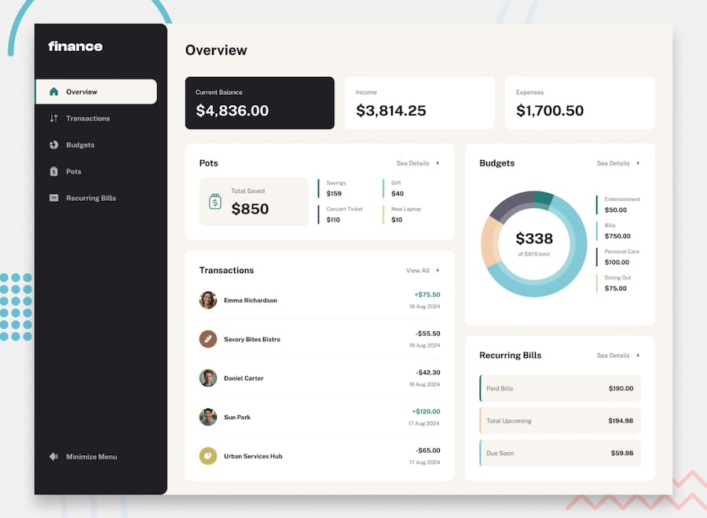

<p align="center">
  
</p>

<h1 align="center">Finco — Personal Finance Dashboard</h1>

<p align="center">
  A full-stack personal finance app built with <strong>Next.js 16</strong>, <strong>Prisma</strong>, and <strong>PostgreSQL</strong>. <br />
  Portfolio-grade project with production-level architecture and UI/UX.
</p>

<p align="center">
  
</p>

---

## ✨ Highlights

| Area             | Detail                                                                 |
|------------------|------------------------------------------------------------------------|
| **Security**     | Arcjet Edge bot protection and API token-bucket rate limiting          |
| **Auth**         | Session-based via Better Auth with Prisma adapter & Zod v4 validation  |
| **Transactions** | Full CRUD, double-entry transfers, debounced search, 6-way sort, pagination |
| **Accounts**     | Horizontal card list, sparkline trend chart, daily histogram, date filters |
| **Budget**       | Custom SVG donut chart, period-aware tracking (W/M/Q/Y), overspent detection |
| **Pots**         | Savings goals with progress tracking, add/withdraw money, target caps  |
| **Recurring**    | Auto-generated transactions on login, paid/upcoming/due-soon tracking  |
| **Dashboard**    | At-a-glance financial summary, date-range filtering, and smart widgets |
| **UI**           | 9 hand-crafted components, Framer Motion animations, custom design tokens |

---

## 🛠 Tech Stack

| Layer      | Technology                                   |
|------------|----------------------------------------------|
| Framework  | Next.js 16 (App Router, RSC, Server Actions) |
| Language   | TypeScript 5                                 |
| Database   | PostgreSQL via Prisma ORM 7                  |
| Auth       | Better Auth (session-based)                  |
| Styling    | Tailwind CSS 4 + custom design tokens        |
| Animations | Framer Motion                                |
| Validation | Zod v4                                       |
| Forms      | react-hook-form                              |
| Charts     | Recharts 3 + custom SVG renderers            |
| Security   | Arcjet                                       |
| Runtime    | Bun                                          |

---

## 🔥 Features

### 🔐 Authentication & Security
- Better Auth with Prisma adapter for session-based auth
- Zod v4 password policies (8+ chars, mixed case, digits, symbols)
- Server-side session guard with redirect
- **Arcjet Protection**: Edge-level bot shielding and token-bucket API rate limiting

### 💳 Transactions
- Full CRUD via Server Actions
- Double-entry transfer bookkeeping with atomic `$transaction` blocks
- Debounced search, 6-way sorting, category/account filtering
- Generic `paginate<T>()` helper with metadata
- Separate Income/Expense/Transfer dialogs with code splitting

### 📊 Budget
- **Custom Donut Chart** — Dual-ring SVG with hover expansion and glow effects
- **Period-Aware Tracking** — Weekly, Monthly, Quarterly, Yearly date boundaries with contextual labels
- **Overspent Detection** — Split-sector pie chart + split progress bars using 130° red dashed SVG patterns
- **Budget CRUD** — Create/Edit with React Hook Form, zod validation, theme & period selectors
- Per-category spend aggregation and deep links to filtered transactions

### 🏦 Accounts
- **Horizontal Card List** — Scrollable account cards with selection highlighting
- **Sparkline Chart** — Recharts AreaChart showing daily income/expense trends with gradient fill
- **Histogram** — CSS-based daily bar chart with income/expense toggle and hover tooltips
- **Date Filtering** — Floating toolbar with daily, monthly, and custom range filters
- **Transaction Table** — Paginated list scoped to selected account and date range

### 🏦 Pots (Savings Goals)
- **Virtual Sub-Account** — Each pot tracks a `total` saved amount toward a `target`
- **Add / Withdraw** — Real-time progress preview before confirming
- **Cap at Target** — Adding money is capped at the target; withdrawals floored at zero
- **Pot CRUD** — Create/Edit/Delete with theme selector and form validation

### 🔄 Recurring Bills
- **Auto-Generation** — On-login check creates due transactions automatically (Option A)
- **RecurringBill Model** — Dedicated template with frequency (Weekly/Monthly/Yearly) and due day
- **Status Tracking** — Green dot (paid), Red dot (due soon/overdue), upcoming indicators
- **Searchable & Sortable** — Bill list with search bar and 6-way sort
- **Summary Sidebar** — Total bills, paid count/amount, upcoming, due soon

### 🧩 UI Components (Built from Scratch)

| Component    | Description                                                     |
|--------------|-----------------------------------------------------------------|
| `Dialog`     | Portal modal with backdrop blur and animations                  |
| `Dropdown`   | Context-based select with smart viewport-aware positioning      |
| `Button`     | Polymorphic with variant support                                |
| `Input`      | Error states, password toggle, helper text                      |
| `Pagination` | URL-driven with ellipsis logic                                  |
| `DatePicker` | Themed calendar wrapper                                         |
| `NavLink`    | Active-route detection with animated indicator                  |
| `Switch`     | Animated toggle with keyboard support                           |
| `Tabs`       | Context-based tabbed interface                                  |

### 🎨 Design & Animations
- Spring-based sidebar expand/collapse with logo crossfade
- Staggered FAB for quick transaction creation
- Smooth page transitions
- 14 theme colors, 6 typography presets, custom scrollbar

---

## 📋 Roadmap

### ✅ Completed
- [x] Authentication (Login, Signup, Sessions)
- [x] Transactions (CRUD, Search, Sort, Filter, Pagination)
- [x] Transfer Bookkeeping (double-entry with linked records)
- [x] Budget Page (donut chart, spend aggregation, summaries)
- [x] Budget CRUD (create, edit with form validation)
- [x] Budget Periods (Weekly, Monthly, Quarterly, Yearly)
- [x] Overspent Visuals (pie chart + progress bars)
- [x] Custom UI Components (9 primitives)
- [x] Animated Sidebar & Global FAB
- [x] Database Seeding (200+ demo records)
- [x] Currency Formatting (`Intl.NumberFormat`)
- [x] Pots (savings goals, add/withdraw, progress tracking)
- [x] Empty States (Transactions, Budget, Pots)
- [x] Recurring Bills (auto-generation, summary, searchable bill list)
- [x] Dashboard — At-a-glance financial summary with date-range filter
- [x] Accounts — Sparkline charts, histogram, horizontal card list, date filtering
- [x] Security — Arcjet bot protection and server action rate limiting

### 📌 Planned
- [ ] Email Verification using Brevo
- [ ] Password Reset feature
- [ ] Mobile Responsive

---

## 🚀 Getting Started

```bash
# Clone & install
git clone https://github.com/sarfarazstark/finco.git
cd finco
bun install

# Configure
cp .env.example .env
# Edit .env with your DATABASE_URL and BETTER_AUTH_SECRET

# Database setup
bunx prisma migrate dev --name init
bunx prisma db seed

# Run
bun dev
```

App available at `http://localhost:3000`.

| Variable             | Description                  |
|----------------------|------------------------------|
| `DATABASE_URL`       | PostgreSQL connection string |
| `BETTER_AUTH_SECRET` | Secret for session signing   |
| `ARCJET_KEY`         | API key for Arcjet security  |

---

## 📄 License

Portfolio project based on a [Frontend Mentor](https://www.frontendmentor.io) premium challenge. Design files not included per their guidelines.

---

<p align="center">
  Built by <a href="https://github.com/sarfarazstark">Sarfaraz</a>
</p>
